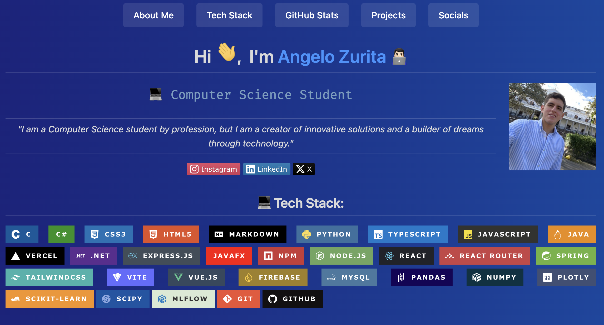
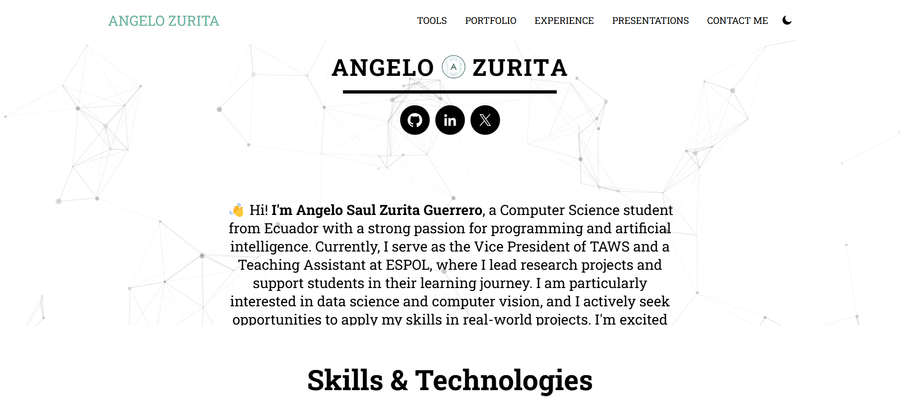

  

    <a href="#aboutMe" style="color: #fff; text-decoration: none; font-weight: 500; padding: 8px 16px; border-radius: 4px; transition: all 0.3s ease; background-color: rgba(255, 255, 255, 0.1);" onmouseover="this.style.backgroundColor='rgba(255, 255, 255, 0.2)'" onmouseout="this.style.backgroundColor='rgba(255, 255, 255, 0.1)'">About Me</a>
    <a href="#🚀-tech-stack" style="color: #fff; text-decoration: none; font-weight: 500; padding: 8px 16px; border-radius: 4px; transition: all 0.3s ease; background-color: rgba(255, 255, 255, 0.1);" onmouseover="this.style.backgroundColor='rgba(255, 255, 255, 0.2)'" onmouseout="this.style.backgroundColor='rgba(255, 255, 255, 0.1)'">Tech Stack</a>
    <a href="#github-stats" style="color: #fff; text-decoration: none; font-weight: 500; padding: 8px 16px; border-radius: 4px; transition: all 0.3s ease; background-color: rgba(255, 255, 255, 0.1);" onmouseover="this.style.backgroundColor='rgba(255, 255, 255, 0.2)'" onmouseout="this.style.backgroundColor='rgba(255, 255, 255, 0.1)'">GitHub Stats</a>
    <a href="#projects" style="color: #fff; text-decoration: none; font-weight: 500; padding: 8px 16px; border-radius: 4px; transition: all 0.3s ease; background-color: rgba(255, 255, 255, 0.1);" onmouseover="this.style.backgroundColor='rgba(255, 255, 255, 0.2)'" onmouseout="this.style.backgroundColor='rgba(255, 255, 255, 0.1)'">Projects</a>
    <a href="#skills-and-tools-recently-learned" style="color: #fff; text-decoration: none; font-weight: 500; padding: 8px 16px; border-radius: 4px; transition: all 0.3s ease; background-color: rgba(255, 255, 255, 0.1);" onmouseover="this.style.backgroundColor='rgba(255, 255, 255, 0.2)'" onmouseout="this.style.backgroundColor='rgba(255, 255, 255, 0.1)'">Recently Learned</a>
  

  

    <H1 align="center" id="aboutMe" > Hi , I'm <a href="https://www.linkedin.com/in/angelo-saul-zurita-guerrero/" target="_blank">Angelo Zurita</a> 👨🏻‍💻</H1>
    

      

        
        

          <table>
              <tr>
                  <td align="center">
                      

                          <i>
                              "I am a Computer Science student by profession, but I am a creator of innovative solutions and a builder of dreams through technology."
                          </i>
                      

                  </td>
              </tr>
          </table>
        

      
      
      
      

      

        
      

    
  
  

  <h2 align="center" id="🚀-tech-stack"> 🚀 Tech Stack </h2>

  

      
      
      
      
      
      
      
      
      
      
      
      
      
      
      
      
      
      
      
      
      
      
      
      
      
      
      
      
      
      
      
      
  

  <h2 align="center" id="github-stats"> 📊 Stats </h2>
   
  

    

      
      
    

             
    

      
    

     
    
  

  

  <h2 align="center" id="projects"> 💻 Projects </h2>

  <table>
    <tr>
      <td>
        
      </td>
      <td>
        <h3>Profile README - Personal GitHub Portfolio</h3>
        
Consists of my personalized profile README, designed to showcase who I am, my skills, and the projects I have developed.

        
        
        
          
        
        
      </td>
    </tr>
    <tr>
      <td>
        
      </td>
      <td>
        <h3>Personal Portfolio</h3>
        
This personal portfolio showcases my skills, experience, and key projects, providing a clear view of my professional journey and enabling collaboration opportunities.

        
        
        
        
          
        
        
      </td>
    </tr>
    <tr>
      <td>
        
      </td>
      <td>
        <h3>Shop Taws</h3>
        
This project is a landing page designed for selling Taws merchandise, providing an attractive and functional space where users can explore and purchase official products.

        
        
        
        
        
          
        
        
      </td>
    </tr>
  </table>

  

  

  <h2 align="center" id="skills-and-tools-recently-learned"> 📚 Skills and Tools Recently Learned </h2>
  <table>
  <thead>
    <tr>
      <th><strong>Technology</strong></th>
      <th><strong>Badge</strong></th>
      <th><strong>Usage</strong></th>
      <th><strong>Projects</strong></th>
    </tr>
  </thead>
  <tbody>
    <tr>
      <td><strong>Markdown</strong></td>
      <td>
        
      </td>
      <td>Documentation and profile design of readmes</td>
      <td>
        
      </td>
    </tr>
    <tr>
      <td><strong>HTML5</strong></td>
      <td>
        
      </td>
      <td>Web structure</td>
      <td>
        
        
        
      </td>
    </tr>
    <tr>
      <td><strong>CSS3</strong></td>
      <td>
        
      </td>
      <td>Giving visual and appealing styles to my HTML elements</td>
      <td>
        
        
      </td>
    </tr>
    <tr>
      <td><strong>Bootstrap</strong></td>
      <td>
        
      </td>
      <td>Responsive design and quick styling</td>
      <td>
        
      </td>
    </tr>
    <tr>
      <td><strong>JavaScript</strong></td>
      <td>
        
      </td>
      <td>Dynamic behavior and functionality</td>
      <td>
        
        
      </td>
    </tr>
    <tr>
      <td><strong>GitHub</strong></td>
      <td>
        
      </td>
      <td>Version control and project deployment</td>
      <td>
        
        
        
      </td>
    </tr>
  </tbody>
</table>

  

